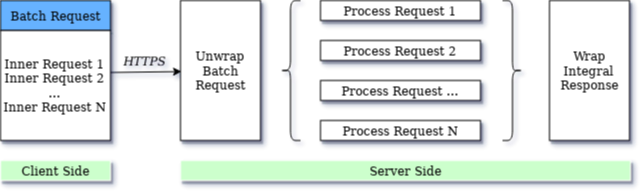

---
title: "Working with batch requests"
type: docs
url: /batch/
description: "Working with Batch Requests."
weight: 10
---

Aspose.Words REST API provides a 'Batch Request' feature that allows developers to group multiple REST API requests into a single request. This method can minimize client-server interactions while maximizing document processing speed.

Since the speed of data processing can have a significant impact on efficiency, sometimes you need to make more REST API calls per unit of time.

Consider the situation where you are writing a document processing solution that makes dozens of REST API calls per second. As each HTTPS connection imposes a certain performance burden on the network, it becomes important to avoid time-consuming TCP negotiations. Combining multiple REST API requests into one can optimize network usage and eliminate network latency issues.

## Batch Request Processing Model

The basic logic of query batching is shown in the diagram below:

The batch processing method includes both parallel and sequential query processing. Parallel requests can be processed in any order with the same result. Sequential requests depend on stepwise processing. The number of internal requests in one batch request is not limited.

The batch requests are very similar to ordinary requests but have two new headers — `RequestId` to identify the request and `DependsOn` for setting the dependency — and the `resultOf(RequestId)` placeholder which is set to the execution result of the corresponding inner request.

The `RequestId` and `DependsOn` headers are required to support sequential processing. For this reason, all `RequestId` values ​​in a batch must be unique. It is usually not necessary to define `RequestId` and `DependsOn` for parallel batch processing.

When all the operations in the batch have finished processing, then a summary response is returned and the HTTPS connection is closed.

### Concurrent Request Processing

In general, batch requests are processed in parallel. Parallel processing, unlike traditional sequential query processing, is more efficient - tasks are split and executed independently on multiple processor cores for faster results, and at the end they are combined again to get an integral response.

It may happen that one of the internal requests in a batch returns an error. In this case, this error does not interrupt the execution of the entire package, and all subsequent internal requests are processed normally.

{}

Since correctness is a central issue in any parallel model, writing a parallel batch query can be tricky. If you want precise, error-free logic, you need to carefully design order-independent file access.

{}


