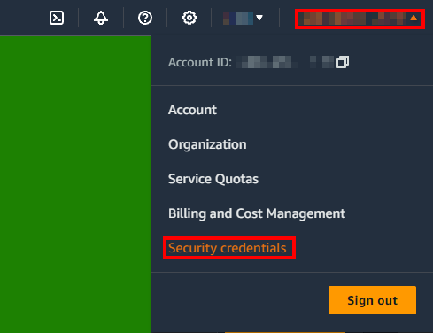
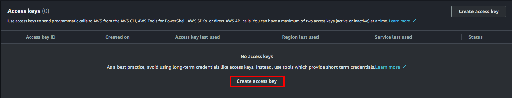

This document serves as a guide on how to deploy Aspose.Words Cloud service as a Docker container in the Amazon S3 environment. It consists of three sections: "Creating and Configuring Amazon S3 Storage", "Creating and Running a Docker Container", and "Verifying the Deployment". By following the steps in this guide, you will be able to leverage the power of the Aspose.Words Cloud API combined with the reliability and scalability of Amazon Web Services (AWS) to work efficiently with Word documents.

## Creating and Configuring Amazon S3 Storage

1. Create a new account or log into an existing one in the Amazon console [https://console.aws.amazon.com/](https://www.google.com/url?q=https://console.aws.amazon.com/&sa=D&source=editors&ust=1714362525467362&usg=AOvVaw0Id0YL4jpRbT_mhkuFtFHE)

2. Once logged in, use the search bar to locate S3 storage among the list of services.


3. Click on "Create bucket". A 'bucket' in Amazon S3 is a logical unit of storage.


4. Enter a name for your bucket. In this guide, "aspose-words-cloud-s3-test" is used as an example, but you can choose any name.


5. Most settings can be left at their default values. After reviewing, click on "Create Bucket" to finalize the creation of your S3 storage.


6. Once the bucket has been successfully created, click on the username in the upper right corner and select "Security credentials" from the drop-down list. This will enable you to manage access to your AWS resources.



7. In the "Access keys" section, select "Create access key". This will generate a pair of access keys that you will use to authenticate your requests to AWS.

**NOTE**: In this tutorial, we will use a root access key that gives access to the entire account through the API. But for production servers we recommend generating keys with access only to the S3 bucket.



The Amazon services setup is complete. Now let's see how to create and run a Docker container. 

## Creating and Running a Docker Container

Setting up a Docker container for Aspose.Words Cloud involves preparing the environment and configuring it to work with your S3 storage. We will use the Docker image "aspose/words-cloud" as the base. By default, "aspose/words-cloud" uses the `/data` folder in the container file system as a storage for files and documents. To use the S3 bucket as a container storage, we need to mount it as the `/data` folder in our image.

1. Create a new `Dockerfile` file and paste the following text into it:

```
FROM aspose/words-cloud:latest
 
## Install required packages
RUN apt-get update -y && \
    apt-get install -y alien dpkg-dev debhelper build-essential wget awscli s3fs && \
    apt-get clean
 
## Install amazon s3 file system
RUN wget https://s3.amazonaws.com/mountpoint-s3-release/latest/x86_64/mount-s3.rpm && \
    alien --install mount-s3.rpm && \
    mkdir /data
 
ENTRYPOINT mount-s3 $S3_BUCKET_NAME /data && dotnet Aspose.Words.Cloud.WebApp.dll
```

**NOTE**: We created our own image based on "aspose/words-cloud" and installed the `mount-s3` utility into it.

2. Build your Docker image using the command `docker build -t aspose-cloud-s3`

3. Create a new `Dockerenv` file and paste the following text into it:

```
LicensePublicKey=
LicensePrivateKey=
User=test
Password=12345678
S3_BUCKET_NAME=aspose-words-cloud-s3-test
AWS_ACCESS_KEY_ID=<PUT_YOUR_ACCESS_KEY_ID_HERE>
AWS_SECRET_ACCESS_KEY=<PUT_YOUR_ACCESS_SECRET_HERE>
```

**NOTE**: In this tutorial, we are using a `Dockerenv` file to make it easy to start the container. But you can pass the necessary environment variables when starting the container via the command line or through the Docker user interface.

4. Edit the parameters in your `Dockerenv` file. These include the `LicensePublicKey` and `LicensePrivateKey` parameters if you have the Aspose metered license, the `User` and `Password` parameters for accessing the Aspose.Cloud API inside the Docker container, and the `S3_BUCKET_NAME`, `AWS_ACCESS_KEY_ID`, and `AWS_SECRET_ACCESS_KEY` parameters for connecting to your S3 bucket:

    * If you have the Aspose metered license, set the `LicensePublicKey` and `LicensePrivateKey` parameters. Otherwise, leave them empty to run the API in trial mode.
    * For the `User` and `Password` parameters, specify the login and password you will use to access the Aspose.Cloud API inside the Docker container.
    * For the `S3_BUCKET_NAME` parameter, specify the name of your S3 bucket.
    * For the `AWS_ACCESS_KEY_ID` and `AWS_SECRET_ACCESS_KEY` parameters, specify the access keys we obtained earlier in the previous section.


5. Start the Docker container with the command

`docker run --rm --env-file Dockerenv --device /dev/fuse --cap-add SYS_ADMIN -p 80:80 aspose-cloud-s3`


**NOTES**. This command includes parameters for mounting the S3 bucket and setting up the network port. We use `--env-file Dockerenv` to specify the file with the environment variables needed to start the container; `--device /dev/fuse --cap-add SYS_ADMIN` parameters are required to mount the S3 bucket in the container operating system; `-p 80:80` is used to forward port 80 from the container to the host.

6. If the container launch was successful, you should see in the console how the S3 bucket is mounted and the Aspose.Cloud API is running.


## Verifying the Deployment

The final step is to test the deployment to ensure everything is functioning correctly.

1. If the container started successfully, you should be able to access the Aspose.Cloud API on port 80. To check this, navigate to the API Reference page in your browser: [http://localhost/v4.0/words/apiReference](https://www.google.com/url?q=http://localhost/v4.0/words/apiReference&sa=D&source=editors&ust=1714362525471833&usg=AOvVaw0xzLV1cPV_noEQCqi5FTqk)
2. Authorize with the login and password you previously specified in the `User` and `Password` environment variables.
3. Find the "Create Document" operation in the list of operations and execute it.


4. Now when you navigate to the S3 bucket browser, you should see the newly created document in the bucket.


Successful testing confirms that your Aspose.Words.Cloud container is correctly deployed and integrated with Amazon S3. You can now proceed to use the API for your document management needs.