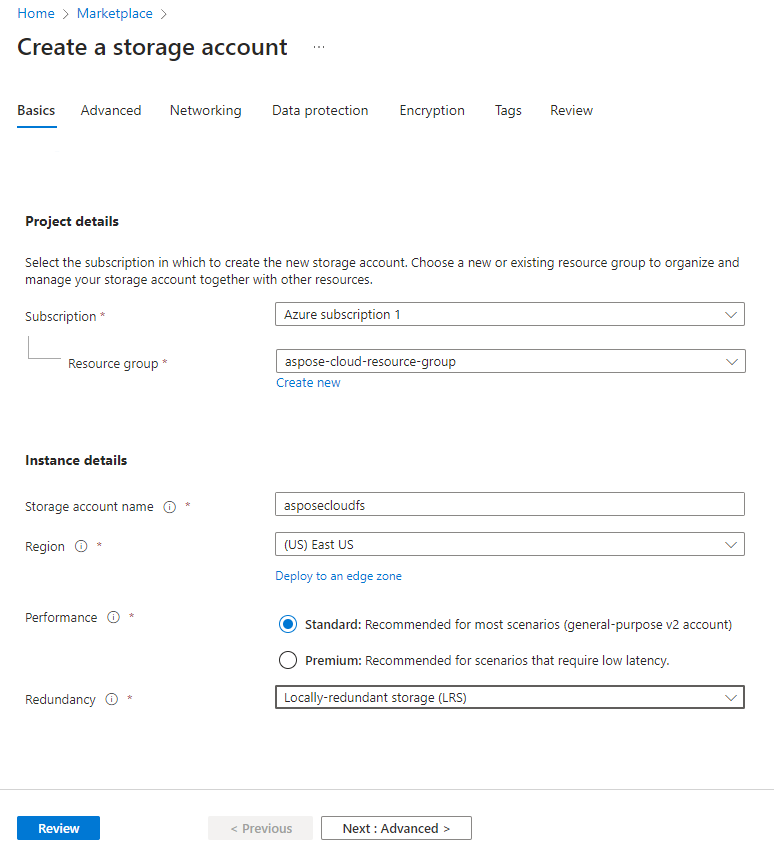
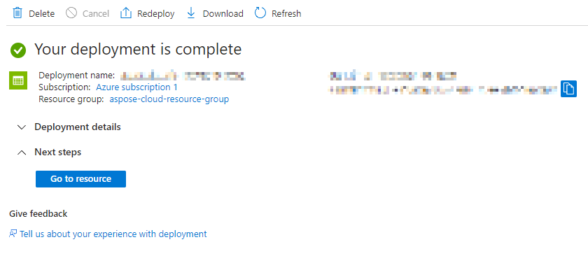
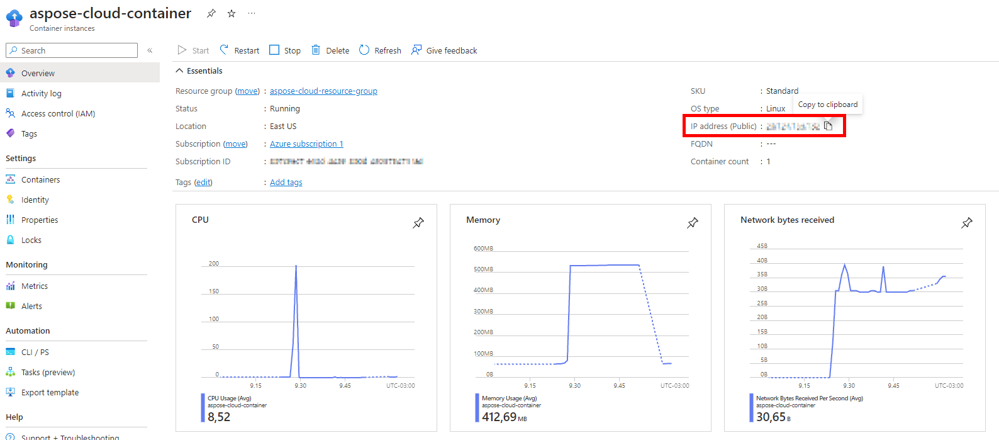

This document serves as a guide on how to deploy Aspose.Words Cloud service as a Docker container in the Microsoft Azure environment. It is divided into four sections: "Create a resource group", "Creating storage for files", "Create a Docker container instance" and "Testing". 

The first section, "Create a resource group", involves setting up a new resource group in Azure. This is a necessary step as it allows you to manage and organize your Azure resources.

The second section, "Create storage for files", guides you through the process of setting up a storage account. This is where the your files will be stored. The guide provides instructions on how to create two file shares, `data` and `fonts`, within the storage account. It also explains how to obtain the access key for the storage account.

The third section, "Create a Docker container instance", provides instructions on how to set up a Docker container instance in Azure. This involves specifying the image source, setting the OS type, adding environment variables for Aspose.Words license and user authentication, and mounting Azure storage into the container.

Finally, the guide provides a simple test to ensure that the deployment was successful. This involves executing a `curl` command in the command prompt and checking the Azure storage account to see if the document created by the request is present.

## Create a resource group

In this section, you are guided through the process of creating a resource group in Azure - a container that holds related resources for an Azure solution. The resource group you create will be used to logically group the resources that you will deploy. You will select a name for your resource group and a region where it will be hosted. The region you select can impact the latency of your services, so it's important to choose a region that is close to your users.

1. Click on "Create a resource" on a main page.


2. Search for "Resource Group".


3. Click on "Create".
4. Enter the name of the resource group (i.e. 'aspose-cloud-resource-group') and select a region.


5. Click on "Review + Create" and then on "Create".

You have successfully created a new resource group in Azure.

## Create storage for files

In this section, you are instructed on how to create a storage account for files in Azure. A storage account in Azure is a unique namespace in Azure for your data. Every object that you store in Azure Storage has an address that includes your unique account name. The combination of the account name and the Azure Storage blob endpoint forms the base address for the objects in your storage account. You will create file shares within this storage account, which will be used to store and organize your files. You will also retrieve the access key for the storage account, which is needed to authenticate your applications and grant them access to your storage account.

1. Click on "Create a resource" on the main page.
2. Search for "Storage Account".


3. Click on "Create".
4. Navigate to the "Basics" tab.

   * Select the resource group you created earlier from the drop-down list.
   * Provide a name for your storage account. This name should be unique and identifiable (i.e. 'asposecloudfs'), as it will be used to distinguish this particular storage account from others in your Azure environment.
   * Select the region where your storage account will be hosted. This should ideally be a location that is geographically close to your users to reduce latency.
   * There is an option to choose "Redundancy". Azure provides different levels of redundancy, and you can choose the one that best suits your needs.



5. On "Advanced" and "Networking" tabs leave the default settings.
6. On the "Data Protection" tab, you can configure the "Soft Deletion" option if necessary. This option, when enabled, provides an additional layer of protection by retaining deleted data for a specified period. Disabling "Soft Delete" means that once data is deleted, it is permanently removed and cannot be recovered.


7. On "Encryption" and "Tags" tabs leave the default settings.
8. On the "Review" tab click on "Create".
9. Wait for the storage account to be created (this may take a few minutes).



Next, we will proceed to create two separate file shares in our Azure Storage account. The 'data' file share will be used to store files that are processed by our Docker container. The 'fonts' file share will store font files that may be required for document processing tasks.

10. Click on "Go to resource".
11. In the left menu click on "File shares".
12. Press on the plus icon to create a new file share.


13. Enter `data` in the "Name" field.


14. Click on "Review + Create" and then on "Create".
15. Go back to the "File Shares" tab to create another file share.


16. Enter `fonts` in the "Name" field.


17. Click on "Review + Create" and then on "Create".


At this point, your your storage account should contain 2 file shares, `data` and `fonts`.

18. Select "Access Keys" from the left menu and copy your access key to the clipboard (it will be required when mounting Azure storage into the container).

This key is a unique ID that grants access to your Storage account. It should be handled with care, as anyone with access to this key can access and manipulate your Storage account.


## Create a Docker container instance

This section guides you on how to create a Docker container instance that will run the Aspose.Words Cloud service. You will also set environment variables and mount Azure storage into the container.

1. Click on "Create a resource" on the main page.
2. Search for "Container Instances".


3. Click on "Create"
4. Navigate to the "Basics" tab.

   * Select the resource group you created earlier from the drop-down list.	
   * Enter a name for the container instance (i.e. 'aspose-cloud-container').	
   * Select the region. You should select the region that is closest to your users to reduce latency.
   
   * For the "Image Source" field, select "Other registry".   
   * In the "Image" field, type `aspose/words-cloud:latest`, which is the path to the latest version of the Aspose.Words Cloud Docker image in Docker Hub.
   * For the "OS Type" field, select "Linux".


5. On the "Networking" tab leave the default settings.


**NOTE: If you are using the paid version of the Aspose.Word Cloud service, the next step is to set up environment variables with your credentials and licence keys. If you are using Aspose.Words Cloud in trial mode, then skip the next step.**

6. On the "Advanced" tab, set up environment variables with your credentials and 'Aspose.Words' licence keys:

|Name               | Description              |
|-------------------|--------------------------|
|User               |Username                  |
|Password           |Password                  |
|LicensePublicKey   |Public key of the license |
|LicensePrivateKey  |Private key of the license|


7. On the "Tags" tab leave the default settings.
8. On "Review + create" tabs click on "Create".
9. Wait for the Docker container instance to be created (this may take a few minutes)


10. Click on "Go to resource".
11. In the left menu click on "Export template".
12. Click on "Deploy".


13. Click on "Edit template".


14. Edit the template to mount Azure storage into the container.

   a. Add the "volumes" section into the main "properties" section of the template. Pass the name of your storage account into the `storageAccountName` field. Paste the access key from the clipboard (we copied it earlier) into the `storageAccountKey` field.
   
   b. Add the "volumeMounts" section into the "properties" section of "container".
   


*NOTE: Example template (to copy-paste volumes to your template) can be found here: [https://pastebin.com/GKEdu8ge](https://pastebin.com/GKEdu8ge)*

15. Save the template after editing.
16. Click on "Review and Create" and the on "Create".
17. Wait for the container instance to be redeployed with new settings (this may take a few minutes).
18. Click on "Go to resources".


   
## Testing

This section provides instructions on how to test the setup. You will be guided on how to execute a `curl` command, and verify the creation of a document in the Azure storage account.

1. Copy IP address from the container overview page.



2. Execute following command in the command prompt (replace `YOUR_IP` with the IP of your container)

```
curl -v "http://YOUR_IP/v4.0/words/create?filename=Test.docx" -X PUT -d ""
```

3. Click on "Storage account" on the main page of Azure.


4. Click on "File shares" in the left menu and select "data" in the shares list.


5. Click on "Browse" in the left menu. You should see the document created by your request in the list of files.


Congratulations! Now you have a fully functional Aspose.Words Cloud service, customized to your needs and able to interact with Azure storage.
